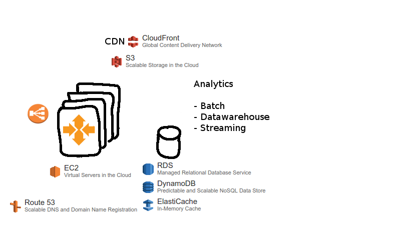
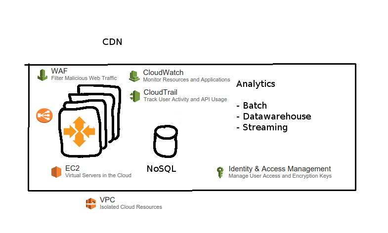

% Amazon Web Services, What's New & Java API
% Markus Dale
% November 2015

# Amazon Web Services (AWS) In the News

Wired Magazine July 2015

Amazon has figured out how to make cloud pay

> $391 million profit based on $1.82 billion in revenue. That’s a
> 407 percent increase in profit from the year before, and an
> 81 percent bump in revenue.

[@finley_amazon_2015]

# AWS
* Started in 2006
* 2015: Over a Million Active Customers in 190 Countries

# Gartner: Infrastructure As A Service Magic Quadrant


# AWS Regions and Edge Points of Presence


# Multiplayer Mobile Game Application

 \


# Scaling Up - Getting Beefy

 \


# Content Delivery Network & Analytics

 \


# Amazon Elastic Compute Cloud (EC2)

 \


# Amazon RDS, DynamoDB, ElastiCache

 \


# Amazon CloudFront CDN, S3

 \


# Amazon Scalable Analytics - Batch, Streaming, Datawarehouse

 \


# Security At Every Layer

 \


# Compute As A Service

 \


# 52 AWS Services:

 \


# Infrastructure As Code - RESTful via Management Console

 \


# Infrastructure As Code - RESTful via AWS CLI
```
aws emr create-cluster
--ec2-attributes SubnetId=subnet-xxxxx \
--release-label emr-4.0.0 \
--instance-groups InstanceGroupType=MASTER,\
InstanceCount=1,InstanceType=m3.xlarge \
InstanceGroupType=CORE,\
InstanceCount=2,InstanceType=m3.xlarge \
--auto-terminate
```

# Infrastructure As Code - RESTful via AWS SDKs

  \  


# Infrastructure As Code - CloudFormation JSON
```
...
"WebServerSecurityGroup": {
      "Type": "AWS::EC2::SecurityGroup",
      "Properties": {
        "GroupDescription": "Enable HTTP access via port 80
        locked down to the load balancer + SSH access",
        "SecurityGroupIngress": [
          {
            "IpProtocol": "tcp",
            "FromPort": "80",
            "ToPort": "80",
            "SourceSecurityGroupOwnerId": {
              "Fn::GetAtt": [
                "ElasticLoadBalancer",
                "SourceSecurityGroup.OwnerAlias"
              ]
...
```

# AWS Marketplace

 \


# Re:Invent 2015

* 2013: 8,000
* 2014: 13,000 attendees
* 2015: Over 20,000 attendees (TechRepublic)
* Capital One and GE as part of key note

# Re:Invent 2015: Internet of Things

 \


# Re:Invent 2015: QuickSight

 \


# Re:Invent 2015: Amazon Kinesis Firehose

* Write Kinesis stream to S3 or Redshift (structured data)
* Configure buffer size, compression, encryption

# Re:Invent 2015: AWS Import/Export Snowball

 \


# Re:Invent 2015: Security

* Amazon Inspector
* AWS WAF
* AWS Config Rules

# Re:Invent 2015: Other Services

* Amazon Elasticsearch Service
* Amazon Kinesis Streams Extended Retention
* AWS Database Migration Service (Preview)
* Amazon RDS for MariaDB
* Amazon Cloudwatch Dashboards
* AWS Lambda
    * Python, Versioning, Scheduled Jobs, and 5 Minute Functions

# AWS SDKs - Credentials

* Environment Variables: AWS_ACCESS_KEY_ID, AWS_SECRET_ACCESS_KEY
* Java System Properties: aws.accessKeyId, aws.secretKey
* Default credentials: ~/.aws/credentials
* Instance credentials (e.g. IAM role assigned to EC2 instance)

# AWS Java SDK - Maven
```
	<dependencies>
	    <!-- Contains all APIs -->
		<dependency>
			<groupId>com.amazonaws</groupId>
			<artifactId>aws-java-sdk</artifactId>
			<version>1.10.32</version>
		</dependency>
    
		<!-- Or API by API:
		<dependency>
	      <groupId>com.amazonaws</groupId>
	      <artifactId>aws-java-sdk-s3</artifactId>
	      <version>1.10.32</version>
        </dependency>
		...
		 -->
	</dependencies>
```
# Links

* https://aws.amazon.com/architecture/icons/

# Picture References
* https://aws.amazon.com/blogs/aws/amazon-quicksight-fast-easy-to-use-business-intelligence-for-big-data-at-110th-the-cost-of-traditional-solutions/


# References {.allowframebreaks}
