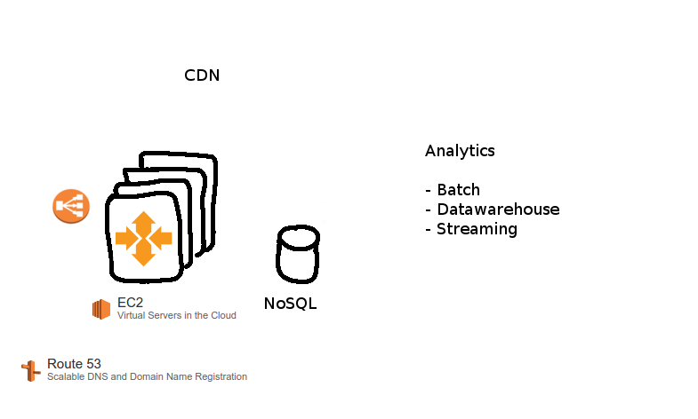
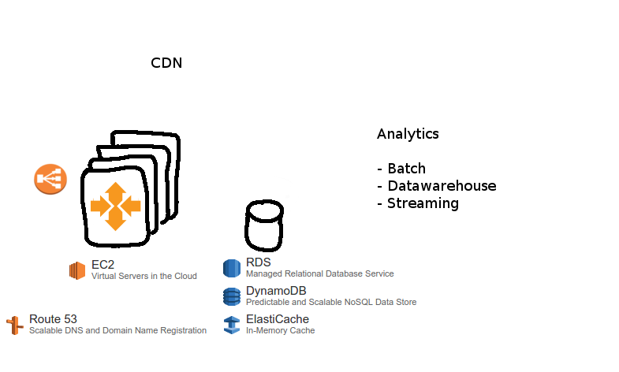

% Amazon Web Services, What's New & Java API
% Markus Dale
% November 2015

# Amazon Web Services (AWS) In the News

Wired Magazine July 2015

Amazon has figured out how to make cloud pay

> $391 million profit based on $1.82 billion in revenue. That’s a
> 407 percent increase in profit from the year before, and an
> 81 percent bump in revenue.

[@finley_amazon_2015]

# AWS According to AWS

* Over a Million Active Customers in 190 Countries

# AWS Regions and Edge Points of Presence

# A Simple Web Application

 \

# Scaling Up - Getting Beefy

 \

# Content Delivery Network & Analytics

 \

# Amazon Elastic Compute Cloud (EC2)

 \

# Amazon RDS, DynamoDB, ElastiCache

 \

# 52 AWS Services:

 \

# References {.allowframebreaks}
