% Amazon Web Services
% Introduction, What's New & Java API
% Markus Dale, February 2016

# Presentation Online
* https://github.com/medale/presentations
* Slides, notes and code sample with Maven

# Amazon Web Services: AWS
* Started in 2006
    * Elastic Compute Cloud (EC2)
    * Simple Storage Service (S3)
* By 2010: Amazon.com retail web services mostly on AWS
* 2015: Over a Million Active Customers in 190 Countries
     * e.g. Netflix, Dropbox, Airbnb, Supercell

# Amazon Web Services (AWS) In the News

Wired Magazine July 2015

Amazon has figured out how to make cloud pay

> $391 million profit based on $1.82 billion in revenue. That’s a
> 407 percent increase in profit from the year before, and an
> 81 percent bump in revenue.

[@finley_amazon_2015]

# Gartner: Infrastructure As A Service Magic Quadrant

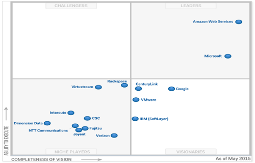


# AWS Regions and Edge Points of Presence

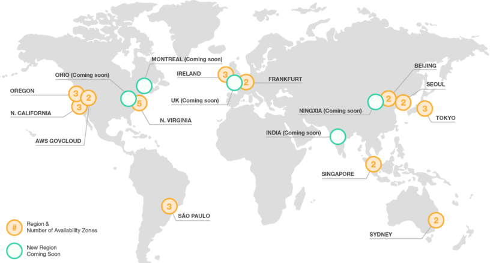

# Multiplayer Mobile Game Application

 \


# Scaling Up/Vertical - Getting Beefy

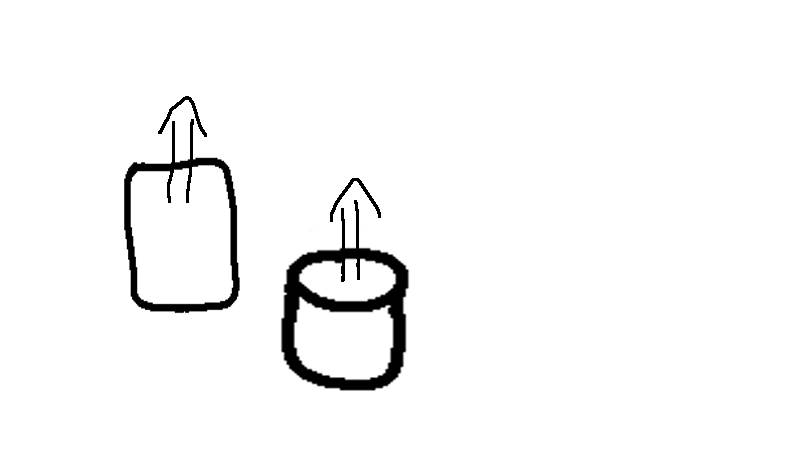 \


# Scaling Out/Horizontal, Content Delivery Network & Analytics

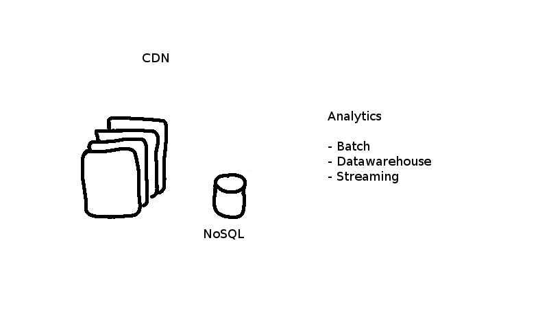 \


# Redundant Environments

* Development
* Testing
* Production
     * DevOps - Blue/Green Deployments?
     * Disaster Recovery

# Amazon Elastic Compute Cloud (EC2)

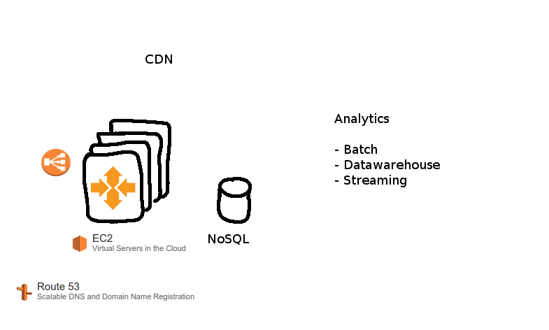 \


# Amazon RDS, DynamoDB, ElastiCache

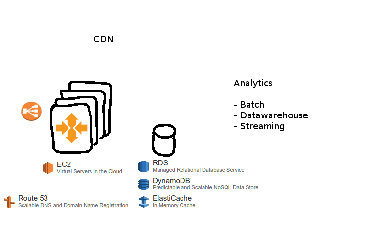 \


# Amazon CloudFront CDN, S3

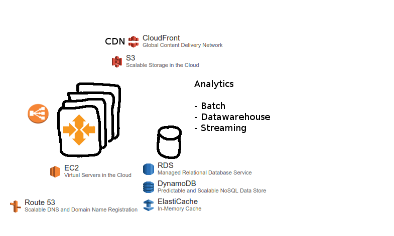 \


# Amazon Scalable Analytics - Batch, Streaming, Datawarehouse

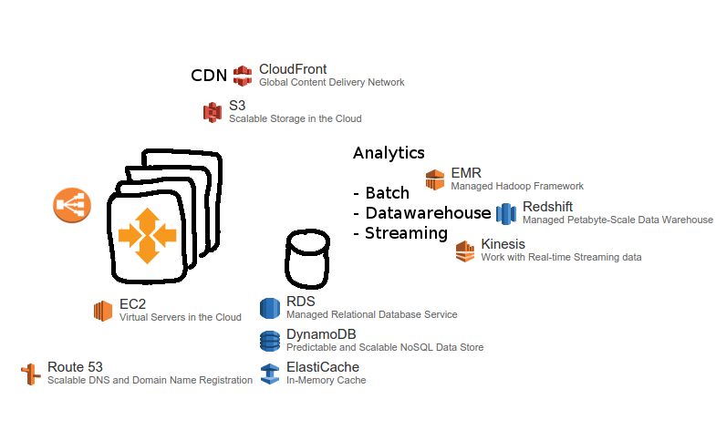 \


# Security At Every Layer

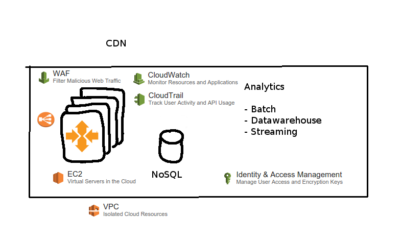 \


# Compute As A Service

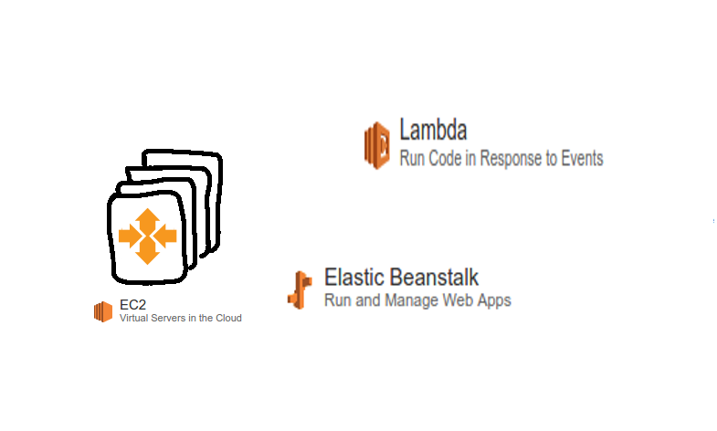 \


# 52 AWS Services:

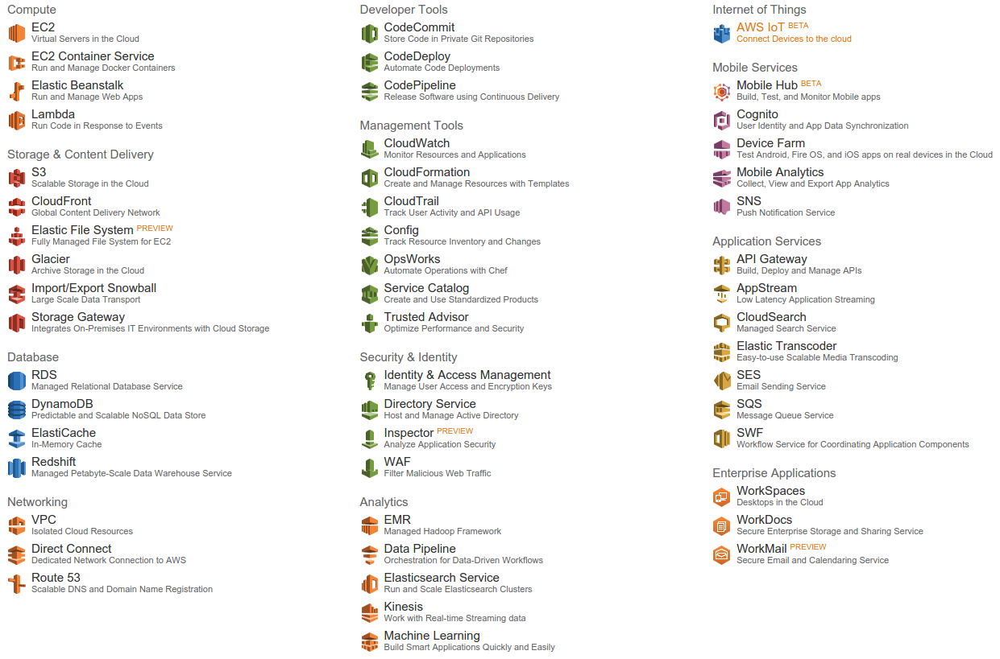 \


# EC2 Instances
* On Demand
* Reserved: up to 75% cheaper, 1-3 year contracts
* Spot Instances

# Infrastructure As Code - RESTful via Management Console

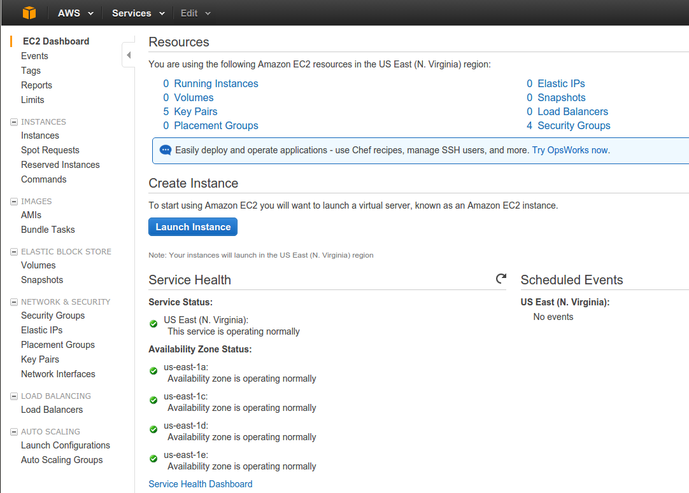 \


# Infrastructure As Code - RESTful via AWS CLI
```
aws emr create-cluster
--ec2-attributes SubnetId=subnet-xxxxx \
--release-label emr-4.0.0 \
--instance-groups InstanceGroupType=MASTER,\
InstanceCount=1,InstanceType=m3.xlarge \
InstanceGroupType=CORE,\
InstanceCount=2,InstanceType=m3.xlarge \
--auto-terminate
```

# Infrastructure As Code - RESTful via AWS SDKs

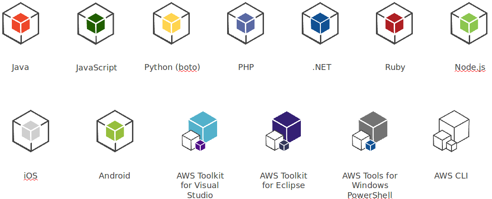  \  


# Infrastructure As Code - CloudFormation JSON
```
...
"WebServerSecurityGroup": {
      "Type": "AWS::EC2::SecurityGroup",
      "Properties": {
        "GroupDescription": "Enable HTTP access via port 80
        locked down to the load balancer + SSH access",
        "SecurityGroupIngress": [
          {
            "IpProtocol": "tcp",
            "FromPort": "80",
            "ToPort": "80",
            "SourceSecurityGroupOwnerId": {
              "Fn::GetAtt": [
                "ElasticLoadBalancer",
                "SourceSecurityGroup.OwnerAlias"
              ]
...
```

# AWS Marketplace

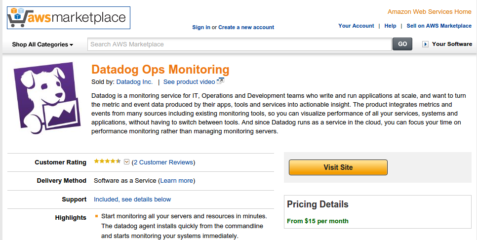 \


# Re:Invent 2015

* 2013: 8,000
* 2014: 13,000 attendees
* 2015: Over 20,000 attendees (TechRepublic)
* Capital One and GE as part of key note

# Re:Invent 2015: Internet of Things

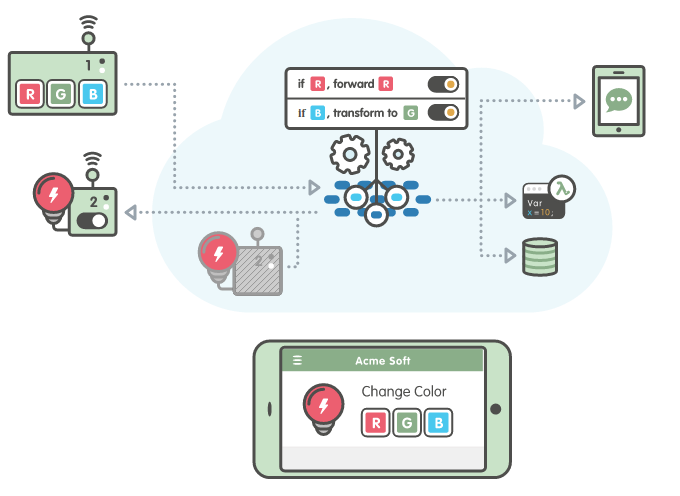 \


# Re:Invent 2015: QuickSight

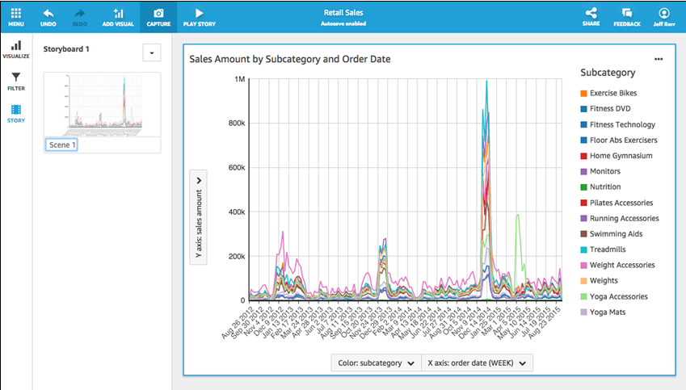 \


# Re:Invent 2015: Amazon Kinesis Firehose

* Write Kinesis stream to S3 or Redshift (structured data)
* Configure buffer size, compression, encryption

# Re:Invent 2015: AWS Import/Export Snowball

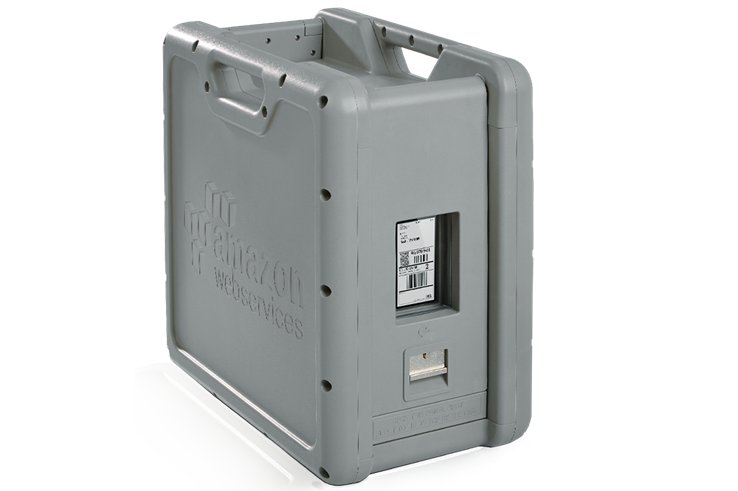 \


# Re:Invent 2015: Security

* Amazon Inspector
* AWS WAF
* AWS Config Rules

# Re:Invent 2015: Other Services

* Amazon Elasticsearch Service
* Amazon Kinesis Streams Extended Retention
* AWS Database Migration Service (Preview)
* Amazon RDS for MariaDB
* Amazon Cloudwatch Dashboards
* AWS Lambda
    * Python, Versioning, Scheduled Jobs, and 5 Minute Functions

# AWS SDKs - Credentials for Java

* Environment Variables: AWS_ACCESS_KEY_ID, AWS_SECRET_ACCESS_KEY
* Java System Properties: aws.accessKeyId, aws.secretKey
* Default credentials: ~/.aws/credentials
* Instance credentials (e.g. IAM role assigned to EC2 instance)

# AWS Java SDK - Maven
```
	<dependencies>
	    <!-- Contains all APIs -->
		<dependency>
			<groupId>com.amazonaws</groupId>
			<artifactId>aws-java-sdk</artifactId>
			<version>1.10.32</version>
		</dependency>

		<!-- Or API by API:
		<dependency>
	      <groupId>com.amazonaws</groupId>
	      <artifactId>aws-java-sdk-s3</artifactId>
	      <version>1.10.32</version>
        </dependency>
		...
		 -->
	</dependencies>
```

# AWS Java S3 SDK
```
//See S3Uploader

		String key = args[0];
		String fileName = args[1];
		AmazonS3 s3Client = new AmazonS3Client(new
      ProfileCredentialsProvider());
		try {
			File file = new File(fileName);
			s3Client.putObject(new PutObjectRequest(
        SLPR_CELL_BUCKET, key, file));
		} catch (AmazonServiceException serviceEx) {
			System.out.println(serviceEx);
		} catch (AmazonClientException clientEx) {
			System.out.println(clientEx);
		}
```

# AWS S3 Management Console
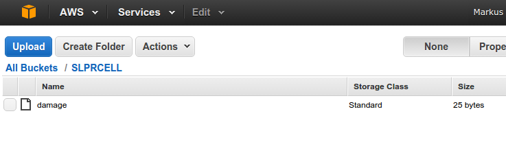 \


# AWS Java SDK Links
* http://aws.amazon.com/documentation/sdk-for-java/
    * Java SDK Developer Guide
    * Java SDK API Javadocs
    * Tips and Tricks (e.g. how to connect via proxy)

# AWS Learning References
* https://aws.amazon.com/training/
    * Free intro labs
    * Training Course
    * Qwiklab online courses
    * Certifications
* 12 month free tier: https://aws.amazon.com/free/
* Re:Invent Videos: https://www.youtube.com/user/AmazonWebServices
* Books: For example Amazon Web Services in Action, Manning, Sept 2015

# End Firehose

Questions? Comments?

# Picture References

* https://aws.amazon.com/architecture/icons/
* https://aws.amazon.com/blogs/aws/amazon-quicksight-fast-easy-to-use-business-intelligence-for-big-data-at-110th-the-cost-of-traditional-solutions/

# References {.allowframebreaks}
