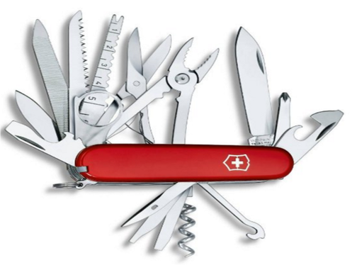

% Amazon Web Services - Beyond EC2 and S3
% DynamoDB, Redshift, Kinesis and Lambda
% Markus Dale, November 2015

# Managed Services With Rich Environment
* EC2 - Elastic Load Balancer service, Auto-Scaling, Security groups...
* S3 - Server-Side Encryption, Versioning, Notification...
* RDS - Relational Database Service...

Developer Productivity

# Right Tool for the Right Job
 \

# AWS DynamoDB
