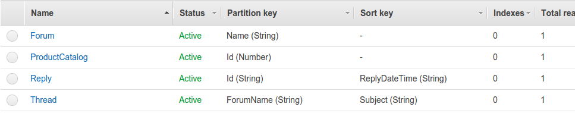
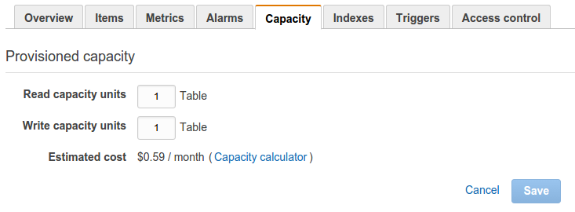
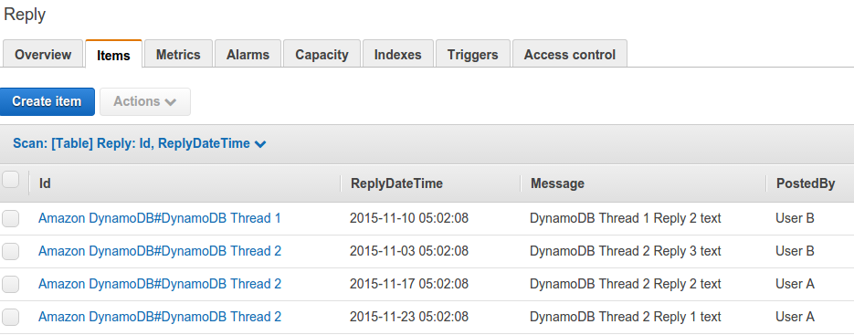
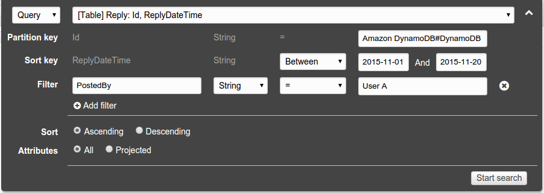
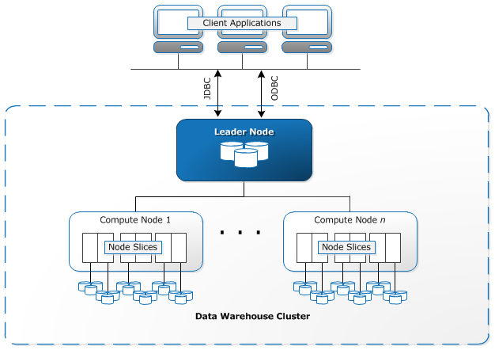
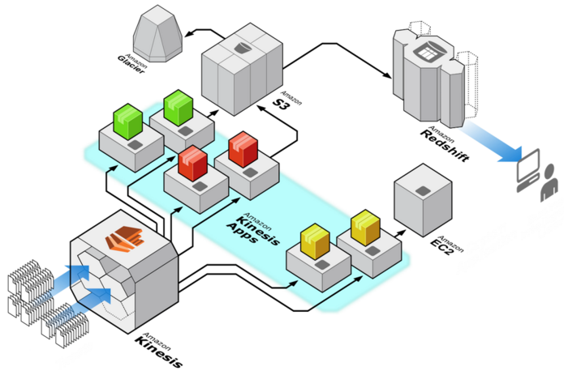

% Amazon Web Services - Beyond EC2 and S3
% DynamoDB, Redshift, Kinesis Streams and Lambda
% Markus Dale, November 2015

# AWS: Managed Services With Rich Environment
* EC2 - Elastic Load Balancer service, Auto-Scaling, Security groups...
* S3 - Server-Side Encryption, Versioning, Notification...
* RDS - Relational Database Service...

Developer Productivity

# Right Tool for the Right Job
 \

# AWS DynamoDB
* Managed NoSQL database since 2012
     * Dynamo key-value paper 2007
* Cost: Provisioned read/write throughput and actual storage
* Scalable (up and down)
* Fault-tolerant
* SSD storage

# DynamoDB Tables
 \

# DynamoDB Provisioned Capacity
 \

# DynamoDB Sample Table - Reply
 \

# DynamoDB Query
 \

# Amazon Redshift
* Fully managed, petabyte-scale data warehouse
* Online Analytic Processing (OLAP) and Business Intelligence
* Single or multi-node cluster in a single AZ

# Redshift Architecture
 \

# Redshift Integration
* Load/store in S3
* DynamoDB
* Elastic MapReduce (EMR)
* Kinesis Streams

# AWS Kinesis Streams
 \

# Kinesis Streams Scaling and Data Records
* Shards: 1 shard = 1 MB/second write, 2MB/second reads, 1000 puts/second
* Sequence Number (assigned by Kinesis)
* Partition Key (user assigned)
* Data blob

# AWS Lambda
* Event-driven compute
* Execute without provisioning/managing server
* Managed execution and scaling
* Python, Java, Node.js (JavaScript) - can call libraries, other languages

# AWS Lambda Triggers Examples
* DynamoDB Table Update
* S3 Object modifications
* Amazon CloudWatch log entry
* Simple Email Service incoming email
* Kinesis Streams message
* Cron schedule

# Lambda Execution
* Stateless
* Charged by 100ms increments, number of requests, GB of RAM allocated
* Default: 3sec execution limit (max 300sec)
* Default: 100 simultaneous executions (can increase)
* IAM policies/roles to manage permissions
