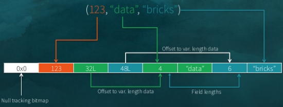
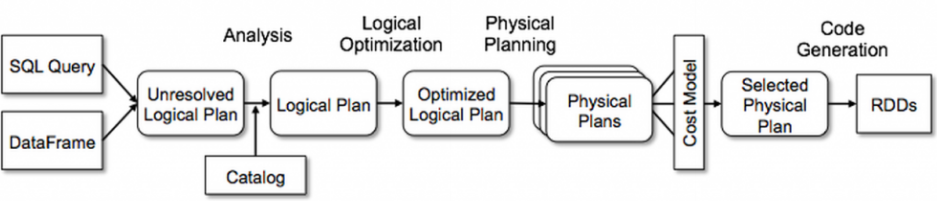
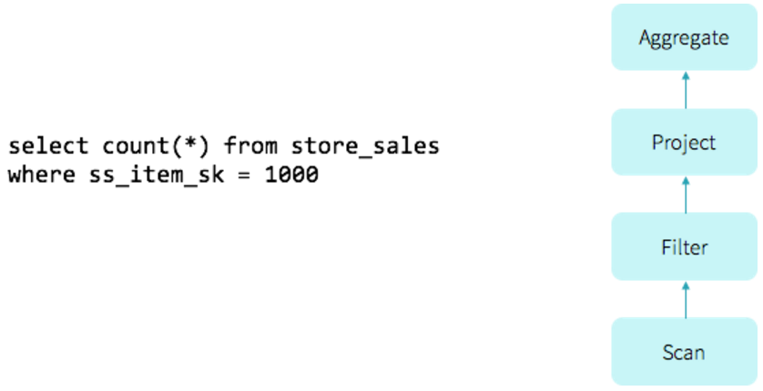
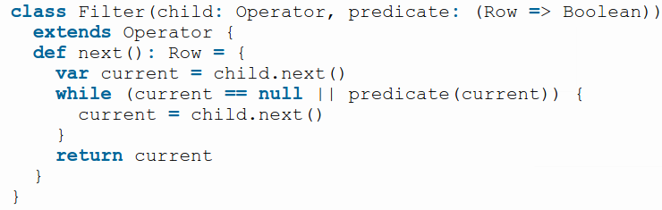
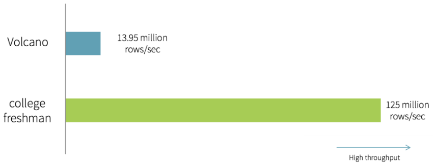
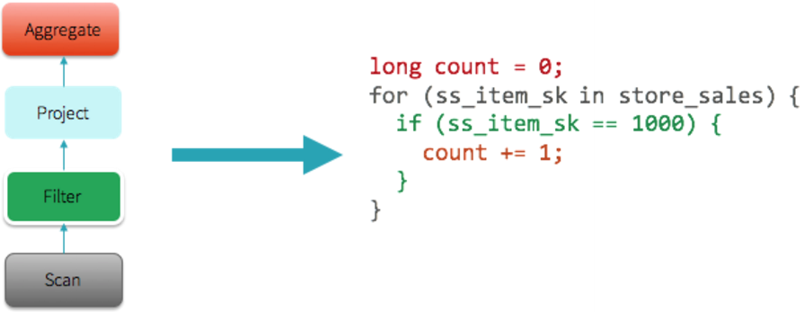
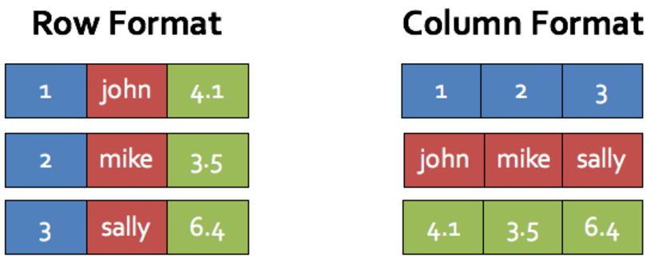

# What's in Apache Spark 2.0.0?

* [Over 2,000 JIRA tickets](https://issues.apache.org/jira/browse/SPARK-15839?jql=project%20%3D%20SPARK%20AND%20%22Target%20Version%2Fs%22%20%3D%202.0.0)
* Some ticket titles: 
     * [(Dataset-oriented) API evolution in Spark 2.0](https://issues.apache.org/jira/browse/SPARK-13485) 
     * [Create a full-fledged built-in SQL parser](https://issues.apache.org/jira/browse/SPARK-12362)
     * [Add support for off-heap caching](https://issues.apache.org/jira/browse/SPARK-13992)
     * [Model export/import for Pipeline API](https://issues.apache.org/jira/browse/SPARK-6725)
     * [Whole stage codegen](https://issues.apache.org/jira/browse/SPARK-12795)
     * [Vectorize parquet decoding using ColumnarBatch](https://issues.apache.org/jira/browse/SPARK-12992)

# Project Tungsten - Closer to bare metal
* Apache Spark 1.3 introduced DataFrames/Catalyst Optimizer
* Tungsten 1.0:
     * Memory management and binary processing
     * Code generation for expression evaluation
     * See Project Tungsten: Bringing Apache Spark Closer to Bare Metal, @xin_project_2015

# Tungsten Binary Format
* Spark 1.5



# Catalyst Optimizer



See Databricks Catalyst Optimizer blog entry, @armbrust_deep_2015

# Project Tungsten 2.0 - reduce CPU bottlenecks
* virtual function calls
* reading or writing intermediate data to CPU cache or memory

# Simple aggregate query with filter



# Pre-2.0 Apache Spark: Volcano Iterator Model



See @graefe_volcano-extensible_1994

# Handwritten Code

```scala
var count = 0
for (ss_item_sk in store_sales) {
   if (ss_item_sk == 1000) {
      count += 1
   }
}
```

# Handwritten vs. Volcano
* Single threaded data from Parquet on disk



# Whole-Stage Code Generation Benefits
* No virtual function dispatches
* Intermediate data in CPU registers
* Loop unrolling and SIMD

# Whole-Stage Code Generation Example



# See Whole-Stage Code Generation with explain()
```
spark.range(1000).
   filter("id > 100").
   selectExpr("sum(id)").explain()

== Physical Plan ==
*Aggregate(functions=[sum(id#201L)])
+- Exchange SinglePartition, None
   +- *Aggregate(functions=[sum(id#201L)])
      +- *Filter (id#201L > 100)
         +- *Range 0, 1, 3, 1000, [id#201L]
```

# Vectorization
* Use if unable to do whole-stage codegen
* Each "next" call runs operator on batched column value



# Demo
* SparkSession
* 1.6 vs. 2.0 TSV file
* ETL to Parquet
* 1.6 vs. 2.0 on Parquet file
* See [http://tinyurl.com/markus-spark-2-0](http://tinyurl.com/markus-spark-2-0) and then src (or https://github.com/medale/presentations/tree/master/spark-performance-2.0-2016-06/src) for 
notebooks
* [https://databricks.com/try-databricks](https://databricks.com/try-databricks) - Databricks Community Edition

# References {.allowframebreaks}
